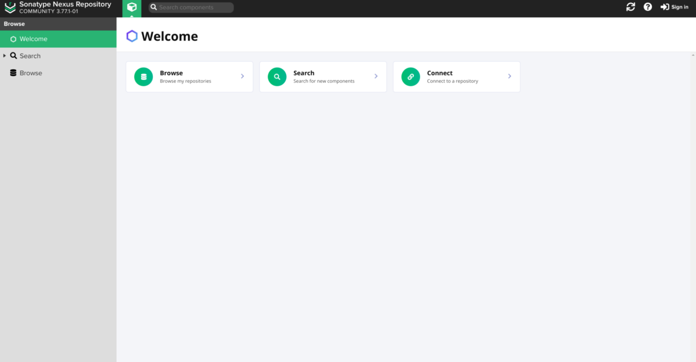
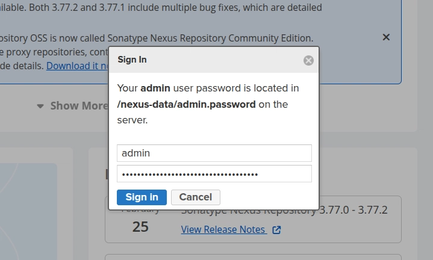
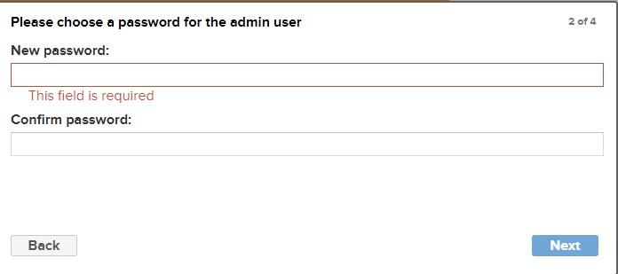
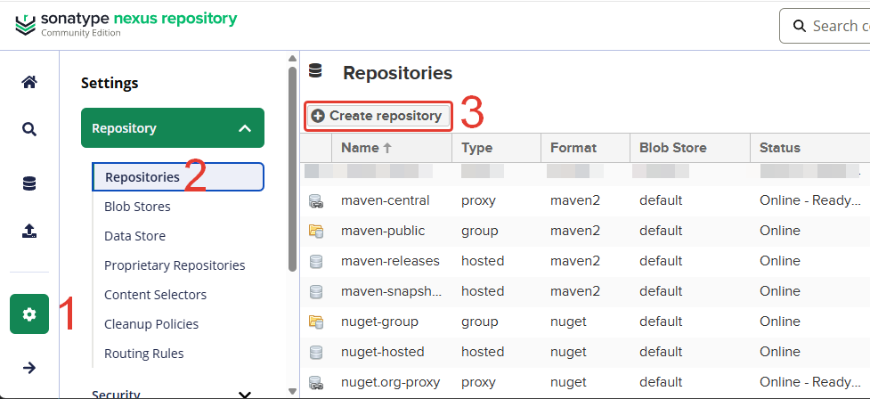
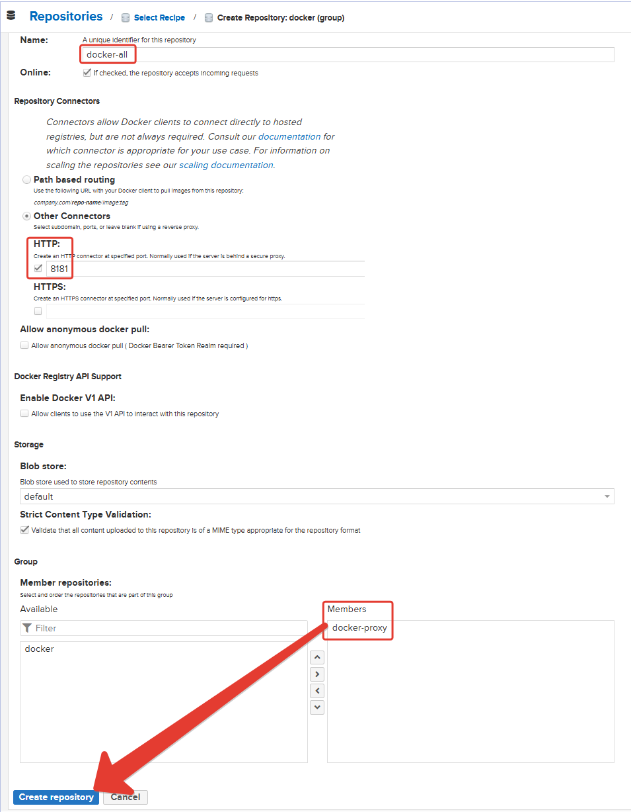

<h1 align="center">nexus3-repository</h1>

# Описание
Запуск и настройка Nexus как Docker репозитория + VLESS

## Подготовка
    
1. Установим Docker<br/>

    ```bash
    sudo curl -fsSL https://get.docker.com | sh
    ```

## Установка

1. Скачайте<br/>

    ```bash
    git clone https://github.com/rasulovdd/nexus3-repository.git && cd nexus3-repository
    ```
    <br/>
2. Отркрываем файл xray.json и редактируем <br/>

    ```bash
    sudo nano xray.json
    ```

    находим эти поля и меняем на свои данные от vless 
    ```bash
    "address": "SERVER_IP"
    "port": 443
    "id": "9c74a382-c7a1-4faa-a82d-84532efed"
    "serverName": "api.github.com"
    "publicKey": "hroijhxhuMkYhtZT36uFDDOeFwXHN0yhr9xFH"
    "shortId": "02ac"
    ```
    <br/>
3. Отркрываем файл nginx.conf и редактируем <br/>
    ```bash
    sudo nano nginx.conf
    ```

    находим эту строку и меняем на свой домен 
    ```bash
    server_name nexus01.domain.ru;
    ```
    <br/>
4. Запускаем Nexus, xray, nginx в docker compose<br/>
    
    ```bash
    docker compose up -d
    ```

    Смотрим log запуска docker контейнера Nexus<br/>
    ```bash
    docker logs -f nexus
    ```
    Дожидаемся запуска и надписи <b>Started Sonatype Nexus</b><br/><br/>

5. Получаем пароль от админской учетной записи. Подключаемся к контейнеру с Nexus<br/>
    
    ```bash
    docker exec -it nexus /bin/bash
    ```
    
    Набираем команду 
    ```bash
    cat /nexus-data/admin.password
    ```
    
## Настройка сервера

1. открываем наш сайт nexus01.domain.ru (который был указан в nginx)
    <p align="center">

    
    
    </p>
    <br/>

2. Меняем пароль администратора. Логин по умолчанию — admin. Пароль мы получали ранее
    
    <p align="center">

    
    
    
    </p>
    <br/>

3. Создание репозитория 

    3.1. docker-proxy

    - Перейдите в настройки Nexus.
    - Выберите вкладку Repositories.
    - Нажмите на кнопку Create repository.

        

    - В списке типов репозиториев выберите docker (proxy)
        ```
        Name: docker-proxy
        Proxy: https://registry-1.docker.io
        Docker Index: Use Docker Hub
        ```
    - Нажимаем Create repository

    
    3.2. Добавьте группу для репозиториев docker-all
    
    - Перейдите в настройки Nexus.
    - Выберите вкладку Repositories.
    - Нажмите на кнопку Create repository.
    
        
    
    - В списке типов репозиториев выберите docker (proxy)
        ```
        Name: docker-all
        HTTP: 8181
        Members: docker-proxy
        ```
    - Нажимаем Create repository
    
    <br/>

4. Включим docker авторизацию

    - Слева нажимаем Settings > Security > Realms
    - Перетаскиваем из колонки Available в колонку Active компонент Docker Bearer Token Realm
    - Внизу жмём Save
    <br/>

## Настройки Клиента

1. На клиенте открываем файл

    ```bash
    sudo nano /etc/docker/daemon.json
    ```
    пример файла (меняем на ваш домен которую вы указали в nginx)
    ```bash
    {
     "registry-mirrors": ["http://nexus01.domain.ru:8181"],
     "insecure-registries": ["nexus01.domain.ru:8181"]
    }
    ```

2. Перезапускаем docker

    ```bash
    sudo systemctl restart docker
    ```
    <br/>

## Пример использования:

1. набираем команду на клиенте 
    ```bash
    docker info
    ```

    Если видим вот эти данные, то все настроено правильно 
    ```
    Insecure Registries:
    nexus01.domain.ru:8181
    ::1/128
    127.0.0.0/8
    Registry Mirrors:
    http://nexus01.domain.ru:8181/
    Live Restore Enabled: false
    ```
